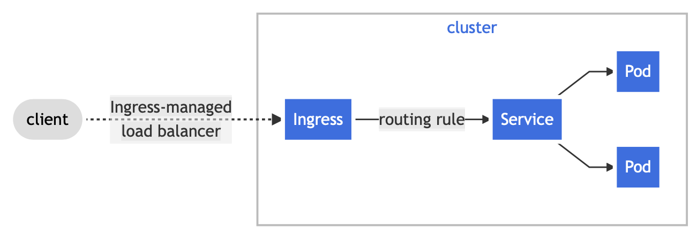
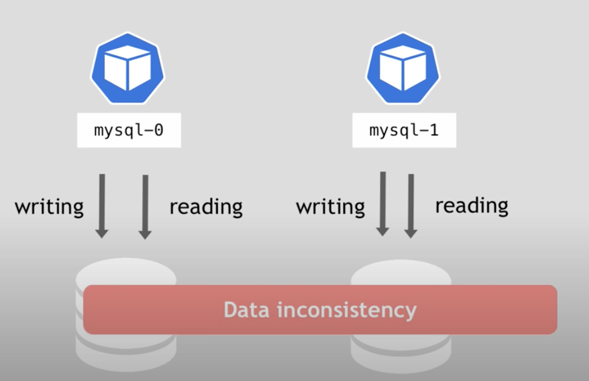
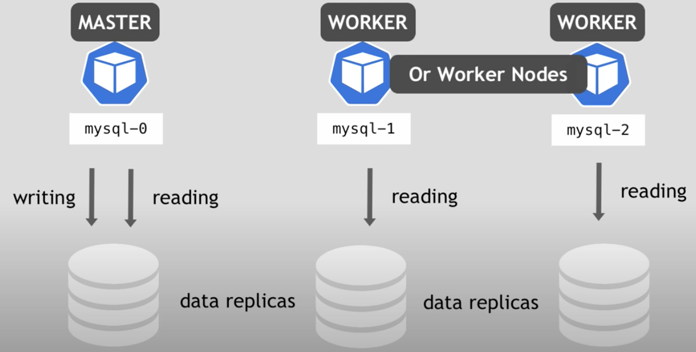
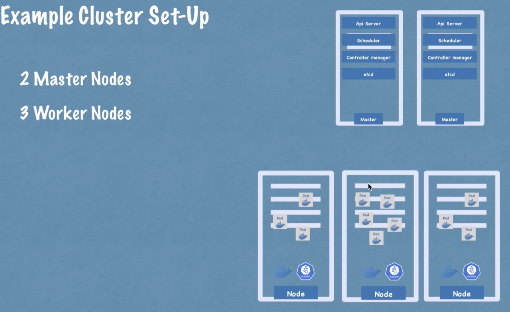
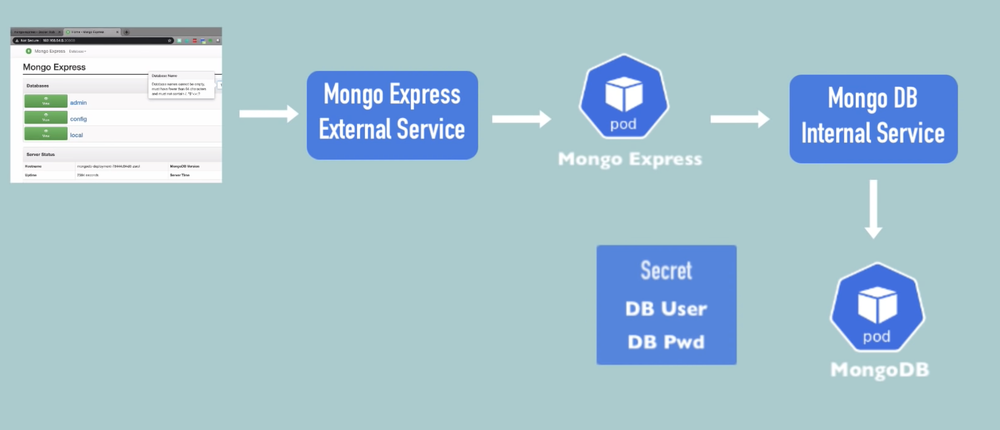

## Introduction

I just started working for a new company, [cloudmobility](https://cloudmobility.io), since I'm now working in a product which provides Kubernetes namespaces I really need to learn about Kubernetes.

To get a quick grasp I watching some youtube content and reading some documentation, I'm also taking some notes along the way that I will leave here for future reference.

## What is Kubernetes?

 - Kubernetes is an open source **container orchestration tool** developed by Google.
 
### What problems does it solve?

 - Helps managing multiple containers;
 - High availability;
 - Scalability;
 - Disaster Recovery;


## Components

### Namespace
> Kubernetes supports multiple virtual clusters backed by the same physical cluster. These virtual clusters are called namespaces.

> Namespaces are intended for use in environments with many users spread across multiple teams, or projects. For clusters with a few to tens of users, you should not need to create or think about namespaces at all. Start using namespaces when you need the features they provide.

> Namespaces are a way to divide cluster resources between multiple users (via resource quota).

**Kubernetes already provides 4 namespaces by default, being:**

- **default**
    - Holds the resources created by the user (if no other namespace is specified in the resource creation)
- **kube-node-lease**
    - Holds info about heartbeats of nodes
    - Each node has an associated lease object in the namespace
    - Determines the availability of a node
- **kube-public**
    - Contains public accessible date
    - Has a configMap with cluster information (**kubectl cluster-info**)
- **kube-system**
    - Should not be touched manually
    - Contains system processes

### Cluster

> A set of Nodes that run containerized applications managed by Kubernetes. For this example, and in most common Kubernetes deployments, nodes in the cluster are not part of the public internet.

### Node
A node is a Kubernetes worker machine that may be physical or virtual.

### Pod

> A pod is the smallest execution unit in Kubernetes. A pod encapsulates one or more applications. Pods are ephemeral by nature, if a pod (or the node it executes on) fails, Kubernetes can automatically create a new replica of that pod to continue operations. Pods include one or more containers (such as Docker containers).

Usually we only use a container per each **pod**.

K8s manages an internal network and it assigns an address to each **pod**.

When a **pod** is recreated **k8s** assigns it a new IP address (that's why we should use **Service** and **Ingress**).

#### Example

```yaml
apiVersion: v1
kind: Pod
metadata:
  name: static-web
spec:
  containers:
    - name: nginx
      image: nginx:1.7.9
      ports:
        - name: nginx
          containerPort: 80
          protocol: TCP
```

### ReplicaSet

> A ReplicaSet's purpose is to maintain a stable set of replica Pods running at any given time. As such, it is often used to guarantee the availability of a specified number of identical Pods.

```yaml
apiVersion: apps/v1
kind: ReplicaSet
metadata:
  name: guestbook-replicaset
  labels:
    app: guestbook
spec:
  # modify replicas according to your case
  replicas: 3
  selector:
    matchLabels:
      app: guestbook
  template: #this is the POD definition template
    metadata:
      labels:
        app: guestbook
    spec:
      containers:
      - name: php-redis
        image: gcr.io/google_samples/gb-frontend:v3
```

>❗ We usually don't specify **ReplicaSets** directly, a **Deployment** should be used insted

### Deployment

A deployment is a blueprint for the application **pods**. With **deployments** we can specify the definition of the **pods** and the **ReplicaSets**.

Deployments can be loosely described as an abstraction of **pods.**

```yaml
apiVersion: apps/v1
kind: Deployment
metadata:
  name: nginx-deployment
  labels:
    app: nginx
spec:
  replicas: 3
  selector:
    matchLabels:
      app: nginx
  template:
    metadata:
      labels:
        app: nginx
    spec:
      containers:
      - name: nginx
        image: nginx:1.14.2
        ports:
        - containerPort: 80
```

>❗ Deployments should only be used for **stateLESS** pods, when there's a need to replicate **stateFUL** pods (i.e: databases) we should use **StatefulSet**.

### Horizontal Pod Autoscaler (HPA)

> The Horizontal Pod Autoscaler automatically scales the number of Pods in a replication controller, deployment, replica set or stateful set based on observed CPU utilization (or, with custom metrics support, on some other application-provided metrics). Note that Horizontal Pod Autoscaling does not apply to objects that can't be scaled, for example, DaemonSets.

```yaml
apiVersion: autoscaling/v1
kind: HorizontalPodAutoscaler
metadata:
	name: hello-kubernetes
	namespace: default
spec:
	maxReplicas: 5
	minReplicas: 2
	scaleTargetRef:
		apiVersion: apps/v1
		kind: Deployment
		name: hello-kubernetes
	targetCPUUtilizationPercentage: 10
```

### Service

> An abstract way to expose an application running on a set of Pods as a network service.
With Kubernetes you don't need to modify your application to use an unfamiliar service discovery mechanism. Kubernetes gives Pods their own IP addresses and a single DNS name for a set of Pods, and can load-balance across them.

It is a permanent IP address that can be attached to a **pod** and it's replicas ****via **selectors**.

There's no connection between the lifecycles of a **pod** and a **service**, meaning that if a **pod** "dies" the service remains there.

You can have **External** and **Internal** services, the first one is exposed to the outside.

Services can also act as load balancers when the **pod** has replicas.

When we create a service K8s will also create an **endpoint** object with the same name as the **service**, this is used to keep track of which pods are members/endpoints of the service.

The **service** knows which port of the service it has to redirect to because it is specified on the configuration yaml has `spec.ports.targetPort`, the `spec.ports.port` it's the entry port of the service.

#### Service Types

The service type can be specified in `spec.type`.

- ClusterIP - default type
    - It's an internal service
    - **Headless Services**
        - Used when we want to communicate with **1 specific pod directly** (no LoadBalancing).
        - It's useful for comunicating with **stateful** applications (i.e: using the **master** database pod to do a write operation).
        - We specify a service as **headless** by setting the `spec.clusterIP` to `None`.
- NodePort
    - Exposes the service on each **Node's** IP at a static port, meaning it can be accessed from the outside (similar to a NAT port forwarding).
    - The outside port is specified in `spec.ports.nodePort` and it can have a value between **30000** and **32767**.
    - A ClusterIP Service, to which the **NodePort** Service routes, is automatically created. You'll be able to contact the **NodePort** Service, from outside the cluster, by requesting `<NodeIP>:<NodePort>`.
    - The **NodePort** is an extension of the **ClusterIP** service.
- LoadBalancer
    - Exposes the service externally through a **LoadBalancer** from the **cloud provider**.
    - **NodePort** and **ClusterIP** services are automatically created and the **LoadBalancer** will route through them.
    - We also need to add a `spec.ports.nodePort` but that port will only be exposed to the LoadBalancer that will then route to the **ClusterIP**.
    - The **LoadBalancer** is an extension of the **NodePort** Service

### Ingress

> Ingress exposes HTTP and HTTPS routes from outside the cluster to services within the cluster. Traffic routing is controlled by rules defined on the Ingress resource.

> Here is a simple example where an Ingress sends all its traffic to one Service:



An ingress alone won't work, we also need an ingress controller, an ingress controller can be installed on a pod.

The ingress controller evaluates all the routes and manages the redirections, it's the entry point for the cluster.

> 💡 On **minikube** we can install an **Nginx** ingress controller with: 
`minikube addons enable ingress`

### ConfigMap

> A ConfigMap is an API object used to store non-confidential data in key-value pairs. Pods can consume ConfigMaps as environment variables, command-line arguments, or as configuration files in a volume.

We can use **ConfigMap** to store external configurations of the applications like urls to other **pods**.

> ❗ Not suitable for storing passwords or other kind of credentials. For that use **Secret**.

### Secret

Secrets are similar to **ConfigMaps** but are used to store sensitive data.

### Volume

Since **pods** are ephemeral all the data can be easily lost, a **volume** is a storage component, meaning that even if a pod is destroyed, we can use **volumes** to make sure that the important data remains there.

A volume can have its storage on a local machine or in a remote storage outside of the cluster (another cloud, on prem, etc).

> 💡 K8s doesn't manage data persistence, meaning that the volumes are **outside** of the cluster.

#### Persistent Volume

Functions as an interface to the actual storage. The actual storage can be the **local disk** or an external **server**. In the creation of the **Persistent Volume** we need to specify what **storage backend** we want to use.

> 💡 Persistent volumes are **NOT** namespaced, they can be accessed from anywhere inside the cluster.

> ❗ Local volumes have two problems, they are tied to one specific node and will not survive a cluster crash.

#### Persistent Volume Claim

Request for storage by a user, **PVCs (persistent volume claims)** consume **PVs (persistent volumes)** resources. A **PVC** can request specific size and access modes (ReadWriteOnce, ReadOnlyMany, ReadWriteMany, etc).

> ❗ A claim must be in the same namespace of the **pod** using the claim.

#### Storage Class

A storage class provisions Persistent Volumes **dynamically**, whenever a **PersistentVolumeClaim** claims it.

In the **storage class** we need to specify a **provisioner (storage backend)**. We also configure other pararmeters like the storage size for example.

The storage classs requested in the **PersistentVolumeClaim** under `spec.storageClassName`.

### StatefulSet

> Manages the deployment and scaling of a set of Pods, and provides guarantees about the ordering and uniqueness of these Pods.

The StatefulSet is complex, so usually databases are often hosted outside of the K8s cluster.

Usually a stateful application cannot be randomly addresses and cannot be created/deleted at the same time.

A stateful set mantains a sticky identity for each pod (pods in a **StatefulSet** are not interchangeable), meaning that even if the event of a **re-schedule** the identity is still the same.

#### The problem



> ❗ Both pods cannot access the data at the same time because they are running **stateful** applications.

#### The solution



> ❗ Those nodes are not using the same physical storage, they are using different persistent volumes with the data replicated between them.

**What K8s doesn't do:**

- Configuration of the cloning and data synchronization
- Make the remote storage available
- Backups

### Rolling Updates

Rolling Updates are a way to roll out app changes in an automated and controlled way through the pods.

They can work with **deployments** and have a rollback functionality.

#### How to configure a rolling update

**Add Liveness and Readiness probes to the deployment**

```yaml
apiVersion: apps/v1
kind: Deployment
...
spec:
  replicas: 1
  template:
    metadata:
		...
    spec:
      containers:
      - name: ...
        image: ...
        ports:
        - containerPort: 9080
				livenessProbe:
					httpGet:
						path: /
						port: 9080
					initialDelaySeconds: 300
					periodSeconds: 15
				
				readinessProbe:
					httpGet:
						path: /
						port: 9080
						initDelaySeconds: 45
						periodSeconds: 5
```

**Add a rolling update strategy to the deployment**

```yaml
apiVersion: apps/v1
kind: Deployment
...
spec:
...
	strategy:
		type: RollingUpdate
			maxUnavailable: 50%
			maxSurge: 2
```

### NetworkPolicy

**Allow all ingress traffic on all pods:**

```yaml
kind: NetworkPolicy
apiVersion: networking.k8s.io/v1
metadata:
  name: web-allow-all
spec:
  podSelector: {}
  ingress:
    - {}
```

## Architecture

Kubernetes can function with master and slave Nodes.

### Nodes

Nodes are managed by the **control plane**.

Every node must have 3 processes installed:

- Container runtime (Docker, Rocket, containerd, etc)
    - Downloads images and runs the containers.
- Kubelet
    - Communicates with the **Kubernetes API Server**.
    - It's a node process that interacts with the container and the node.
    - Kubelet is responsible for starting the pod and container using the defined container runtime and also ensure that they are running.
    - Reports health and status to the control plane.
- Kube proxy
    - It's a network proxy that forwards the requests and also can apply defined rules.
    - When a container makes a request to another service the kube proxy is responsible to forward the request to an available service.

### Master node (Control Plane)

There can be multiple master nodes, with the **api-server** being load balanced.

Every master node needs to have 4 processes, being:

- Api server (kube-apiserver)
    - It is a cluster gateway
    - Also functions as a gatekeeper for authentication
- Scheduler
    - Assigns **pods** to **nodes** according to constraints and available resources on each node in the cluster.
    - After the scheduler chooses the most suitable **node** the given node forwards the execution to it's own **kubelet**.
- kube-controller-manager
    - Runs controller processes like:
        - Node controller: Responsible for noticing and responding when nodes go down.
        - Job controller: Watches for Job objects that represent one-off tasks, then creates Pods to run those tasks to completion.
        - Endpoints controller: Populates the Endpoints object (that is, joins Services & Pods).
        - Service Account & Token controllers: Create default accounts and API access tokens for new namespaces.
- etcd
    - It's the "cluster brain"
    - Key value store for all cluster data.
    - All cluster changes are stored there.
    
    > ❗ The etcd does not store application data, only data relative to the cluster is being stored there.
    
    

### Example Cluster Set-Up



### Layers of abstraction

- **Deployment** manages a **ReplicaSet** which manages a **Pod** which is an abstraction of a container.
- Everything below a **Deployment** is usually managed automatically by Kubernetes.

## Kubectl commands

`kubectl` is a command line tool that provides access to the `kube-api`.

### Imperative commands

Imperative commands allow quick creation, update and deletion of Kubernetes objects.

They are easier to learn, but they don't provide an audit trail.

Flexibility is low, needs multiple commands to do further changes.

**Imperative command examples:**

```bash
# Create a POD that runs a NGINX container
kubectl run nginx --image nginx
```

### Imperative commands with configuration templates

Those commands rely on configuration templates defined as yaml files.

They specify an operation such as create, replace or delete, that operation is part of the command and not the template.

```bash
kubectl create -f nginx.yaml
```

### Declarative commands

With declarative commands the files define the **desired state**, kubernetes executes the operations needed to get to that state.

The action is not specified on the command, the needed operations are inferred by kubectl.

The command works on both files and directories.

```bash
# Execute configurations files on a directory
kubectl apply -f nginx/
```

### Example commands

#### Get

```bash
# Get something on namespace
kubectl get <component> -n <namespace_name>

# Get all components
kubectl get all

# Get the nodes
kubectl get nodes

# Get the pods
kubectl get pods

# Get the pods with more info
kubectel get pods -o wide

# Get the services
kubectl get services

# Get the deployments
kubectl get deployments

# Get the replicaSets
kubectl get replicasets

# Get the secrets
kubectl get secrets

# Get the deployment config
kubectl get deployment -o yaml

# Get info about a pod
kubectl describe pod <POD_NAME>

# Get info about a service
kubectl describe service <SERVICE_NAME>

# Get pod logs
kubectl logs <POD_NAME>
```

#### Create

```bash
# Create a POD
## PODs cannot be created directly, we need to use a deployment 
## (abstraction over pods)
kubectl create deployment <NAME> --image=<IMAGE> [--dry-run] [options]

# Edit a deployment / show details
kubectl edit deployment <NAME>

# Create a namespace
kubectl create namespace <NAME>

# Apply a configuration file
kubectl apply -f <FILENAME>

****# Apply a configuration file in a namespace (not a good practice)
kubectl apply -f <FILENAME> --namespace=<NAMESPACE>
```

#### Delete

```bash
# Delete deployment
## This deletes everything bellow the deployment (ReplicaSets, PODs, etc)
kubectl delete deployment <DEPLOYMENT_NAME>
```

#### Others

```bash
# Enter a shell inside the pod
kubectl exec -it <POD_NAME> -- /bin/bash

# Autoscale based on CPU usage
kubctl autoscale deploy <POD_NAME> --min=2 --max=5 --cpu-percent=10

# Switch namespace (kubens)
kubens <namespace>
```

## Configuration files

### Configuration file structure

Each configuration file has **3 parts** being:

- Metadata
- Specification (spec)
    - Has component specific configuration
- Status
    - Is automatically added by Kubernetes
    - The information being placed there comes from **etcd**
    - To get the deployment config with the current status we run:
    
    ```yaml
    kubectl get deployment -o yaml
    ```
    

### Using configuration files

```bash
# Apply a configuration file
kubectl apply -f <FILENAME>

# Delete with a configuration file
kubectl delete -f <FILENAME>
```

#### Examples

**nginx-deployment.yaml**

```yaml
apiVersion: apps/v1
kind: Deployment
metadata:
	name: nginx-deployment
	labels:
		app: nginx
spec:
	replicas: 1
	selector:
		matchLabels:
			app: nginx
	template:
		metadata:
			labels:
				app: nginx
		spec:
			containers:
			- name: nginx
				image: nginx:1.16
				ports:
				- containerPort: 80
```

> 💡 If we need to change some configuration (i.e: replicas), we can just update the file and execute **kubectl apply -f nginx-deployment.yaml** again.


### Connecting Services to Deployments

The **Service** references the **Deployment** in the **selector** area, which is defined in the [**labels.app**](http://labels.app) of the **deployment**.

```yaml
apiVersion: apps/v1
kind: Deployment
metadata:
	name: nginx-deployment
	labels:
		app: nginx
spec:
	replicas: 1
	selector:
		matchLabels:
			app: nginx
	template:
		metadata:
			labels:
				app: nginx
		spec:
			containers:
			- name: nginx
				image: nginx:1.16
				ports:
				- containerPort: 8080
```

```yaml
apiVersion: v1
kind: Service
metadata:
	name: nginx-service
spec:
	selector:
		app: nginx
	ports:
	- protocol: TCP
		port: 80
		targetPort: 8080
```

### Creating a component in a namespace

By default every component is created in the **default** namespace, we can define it by specifying a namespace in **metadata.namespace**:

```yaml
apiVersion: v1
kind: Service
metadata:
	name: nginx-service
	namespace: my-namespace
spec:
	selector:
		app: nginx
	ports:
	- protocol: TCP
		port: 80
		targetPort: 8080
```

> 💡 You can find the namespace in `metadata.namespace`

## Demos

### Deploying Mongo + Mongo Express



#### Creating the secret

The mongo db needs to have a root username and password, we could define a plain text value in the deployment, but the best practice is to have it in a secret.

The secrets in the need to be encoded in **base64**.

**mongo-secret.yaml**

```yaml
apiVersion: v1
kind: Secret
metadata:
  name: mongodb-secret
type: Opaque
data:
  mongo-root-username: dXNlcm5hbWU=
  mongo-root-password: cGFzc3dvcmQ=
```

>❗ We need to apply the secret before referencing it, otherwise the deployment will fail.

**Apply the secret:**

```sh
kubectl apply -f mongo-secret.yaml
```

#### Creating mongo db the deployment and internal service

In the deployment we specify the mongo-db **pod**  and reference the **secret** we created earlier.

We are also creating the internal service in the same file, but we could be doing that in a separate file as well.

**mongo-deployment.yaml**

```yaml
# MongoDB deployment
apiVersion: apps/v1
kind: Deployment
metadata:
  name: mongodb-deployment
  labels:
    app: mongodb
spec:
  replicas: 1
  selector:
    matchLabels:
      app: mongodb
  template:
    metadata:
      labels:
        app: mongodb
    spec:
      containers:
      - name: mongodb
        image: mongo
        ports:
        - containerPort: 27017
        env:
        - name: MONGO_INITDB_ROOT_USERNAME
          valueFrom:
            secretKeyRef:
              name: mongodb-secret
              key: mongo-root-username 
        - name: MONGO_INITDB_ROOT_PASSWORD
          valueFrom:
            secretKeyRef:
              name: mongodb-secret
              key: mongo-root-password
---
# Internal Service
apiVersion: v1
kind: Service
metadata:
  name: mongodb-service
spec:
  selector:
    app: mongodb
  ports:
    - protocol: TCP
      port: 27017
      targetPort: 27017
```

```sh
kubectl apply -f mongo-deployment.yaml
```

#### Create the ConfigMap for Express and other clients

We need some place to store the mongo db **pod** URL, we could be putting that hardcoded in the deployment environment variable, but that would be not as flexible and would not "scale" to other clients.

**mongo-configmap.yaml**

```yaml
apiVersion: v1
kind: ConfigMap
metadata:
  name: mongodb-configmap
data:
  database_url: mongodb-service
```

```sh
kubectl apply -f mongo-configmap.yaml
```

#### Create mongo express deployment and external service

**mongo-express-deployment.yaml**

```yaml
# Mongo Express deployment
apiVersion: apps/v1
kind: Deployment
metadata:
  name: mongo-express-deployment
  labels:
    app: mongo-express
spec:
  replicas: 1
  selector:
    matchLabels:
      app: mongo-express
  template:
    metadata:
      labels:
        app: mongo-express
    spec:
      containers:
      - name: mongo-express
        image: mongo-express
        ports:
        - containerPort: 8081
        env:
        - name: ME_CONFIG_MONGODB_ADMINUSERNAME
          valueFrom:
            secretKeyRef:
              name: mongodb-secret
              key: mongo-root-username 
        - name: ME_CONFIG_MONGODB_ADMINPASSWORD
          valueFrom:
            secretKeyRef:
              name: mongodb-secret
              key: mongo-root-password
        - name: ME_CONFIG_MONGODB_SERVER
          valueFrom:
            configMapKeyRef:
              name: mongodb-configmap
              key: database_url
---
# External Service
apiVersion: v1
kind: Service
metadata:
  name: mongo-express-service
spec:
  selector:
    app: mongo-express
  type: LoadBalancer
  ports:
    - protocol: TCP
      port: 8081
      targetPort: 8081
			nodePort: 30000
```

**How to specify an external service:**

An external service is created in the same way as an internal one, except for the following attributes:

- **spec.type** should be defined as **LoadBalancer**, which is an unfortunate name, since and internal service does load balancing as well.
- **ports.nodePort** should be set, it specifies the port in which the service will be listening from outside the cluster. In the default configuration the port should be between **30000-32767**.

```sh
kubectl apply -f mongo-express-deployment.yaml

# If on minikube also run
minikube service mongo-express-service
```

### Create an ingress for minikube dashboard

**dashboard-ingress.yaml**
```yaml
apiVersion: networking.k8s.io/v1
kind: Ingress
metadata:
  name: dashboard-ingress
spec:
  rules:
  - host: dashboard.localhost
    http:
      paths:
      - path: /
        pathType: Prefix
        backend:
          service:
            name: kubernetes-dashboard
            port:
              number: 80
```

```sh 
kubectl apply -f dashboard-ingress.yaml
```

Now we need to get the IP of the ingress, for that we run `kubectl get ingress` and we should get something like this:
```sh
NAME                CLASS    HOSTS                 ADDRESS        PORTS   AGE
dashboard-ingress   <none>   dashboard.localhost   192.168.64.2   80      37s
```

We need to take that address and add an entry to `/etc/hosts` with the following content **(adapted to dashboard-ingress IP address)**:
```sh
192.168.64.2    dashboard.localhost
```


## Bonus: Helm

### What is Helm

- It's a package manager for K8s, it can package yaml files and distribute them in public and private repositories.
- It is a templating engine, it can get values from a **values.yaml** (or --set flag) and place them in the template.

### Use cases

- For different applications with the same template
- For same applications across different environments

### Helm charts

An helm chart is a bundle of YAML files with all configurations needed to run a certain application in K8s.

#### Directory structure

- **mychart** (name of the chart)
    - **Chart.yaml** (meta info about the chart)
    - **values.yaml** (values for the template files)
    - **charts/** (chart dependencies)
    - **templates/** (the template files)  s

When executing `helm install <chartname>` the template files will be filled with the values from `values.yaml`
